# Adding Google Calendar Account

As of v0.9.0, MMDL supports Google Calendars. Note that Google Tasks are not supported, because Google doesn't use CalDAV for tasks, but rather use their custom API. Supporting Google Tasks is not on the roadmap for this project.

Making Google Calendar work is a long process. It requires OAuth authentication for using CalDAV API.

Note the Google OAuth requires HTTPS to work. So you will have to set up HTTPS for your MMDL server, whether you're running it on localhost or on a remote server.

## Enable Google CalDAV API

First of all, we need to enable Google's CalDAV API. 

- Visit Google Developer Console at [https://console.developers.google.com/](https://console.developers.google.com/) and sign in with your Google Account.

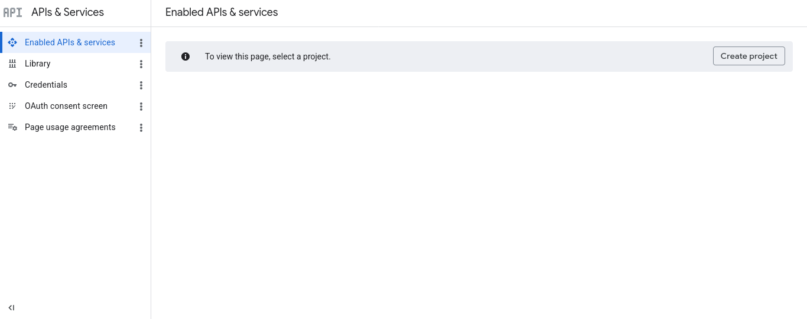 

- Click on "Create Project" to create a new project.

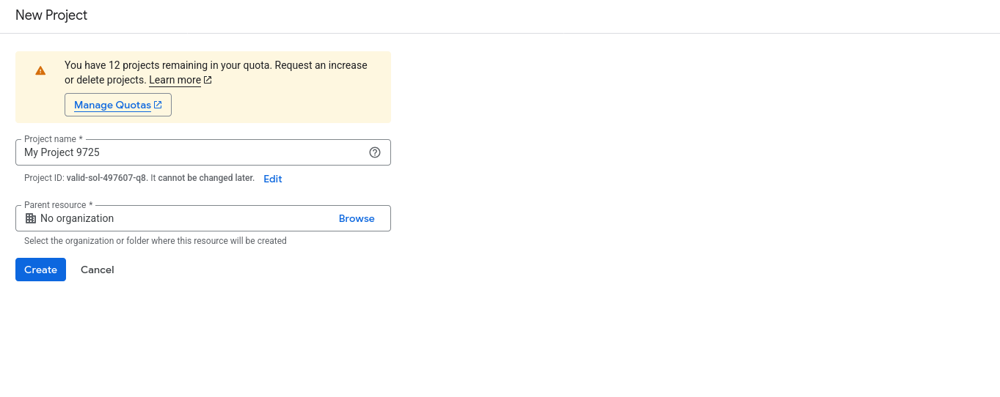 

 - You would then be taken to the newly created project's page.

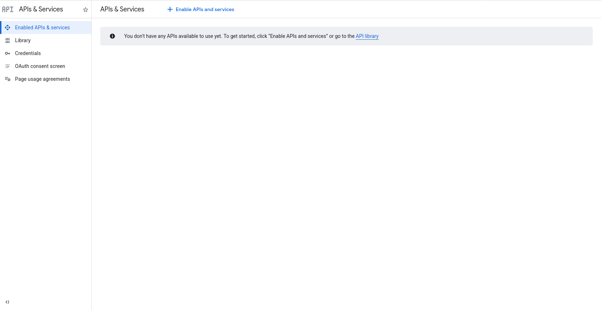 

- Click on "Enable APIs and services" link, search for "CalDAV API", and click "Enable".

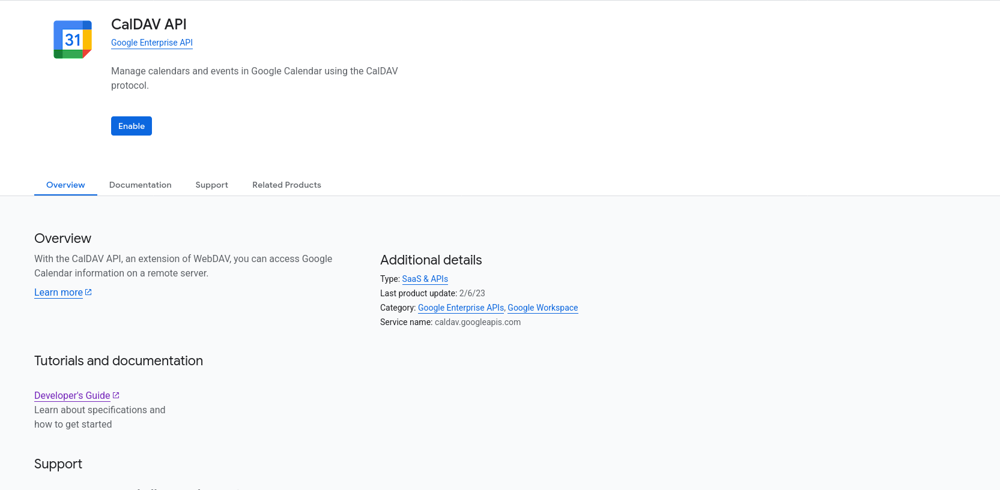 

## Configure OAuth Consent Screen and Creating an App


- The next step is to configure OAuth Consent Screen. To do that, click on "OAuth Consent screen" on the panel on the left. Thereafter, click on "Get started".

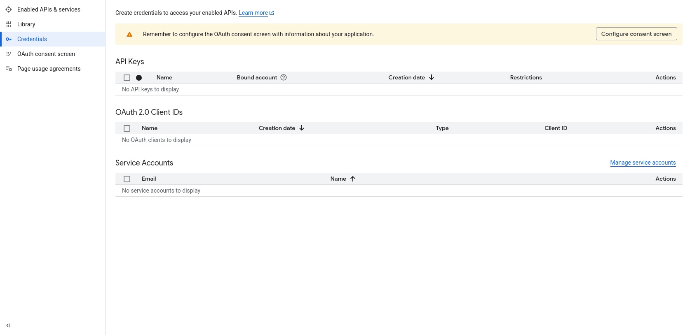 

- You will need to create an App, let's call it "MMDL".

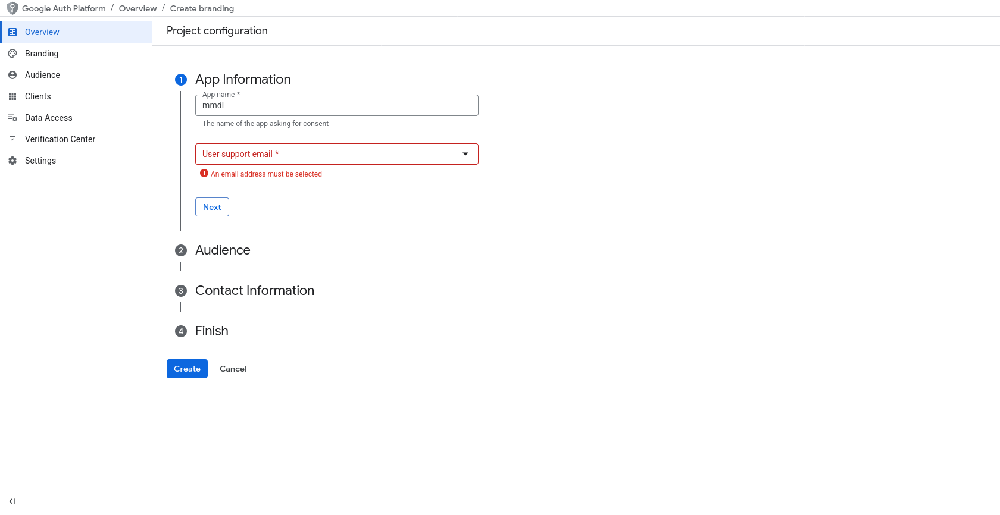 

- On the next step, select "External" as audience for your new app.

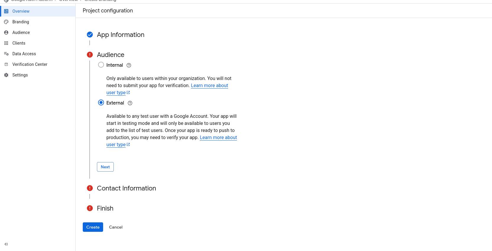 

## Creating your OAuth Credentials

- Once your app is created, you will need to create credentials for this new app. Click on "Create OAuth Client" on the "Overview" page.

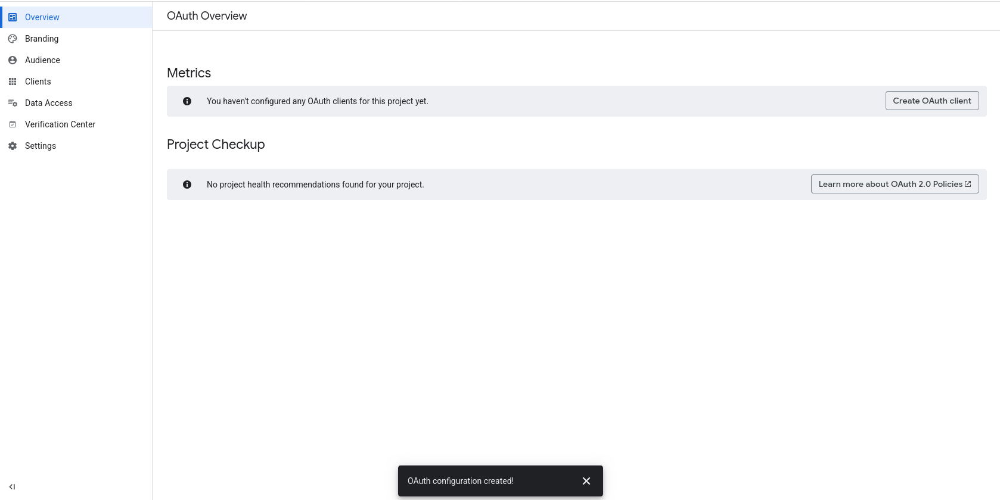 

- On the "Create OAuth Client ID" screen,  select application type as "Web application".

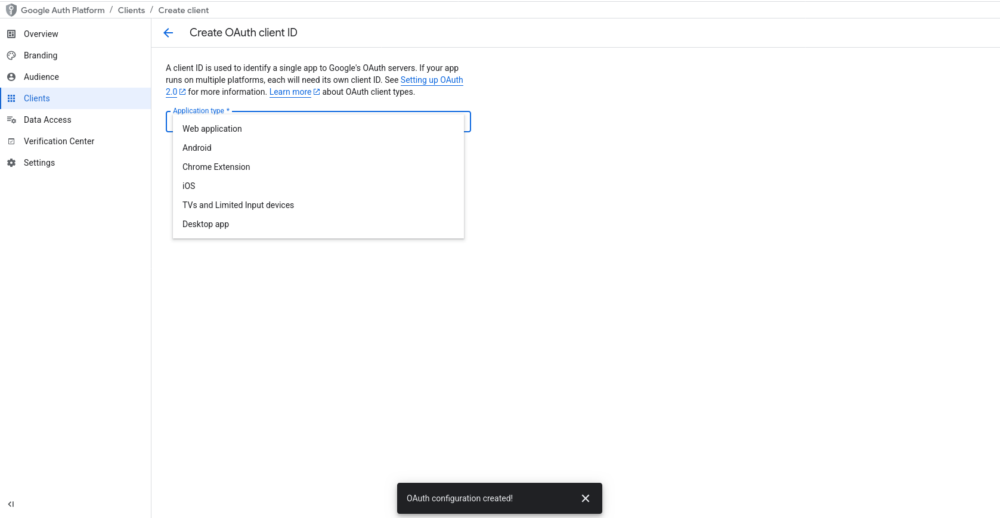 

- You will need to create a name for this client id. On clicking "Add", you will be shown your newly created client details. Copy/Download the "Client Id" and "Client Secret". Note that if you forget or lose the secret, you will need to create a new secret for the same client id.

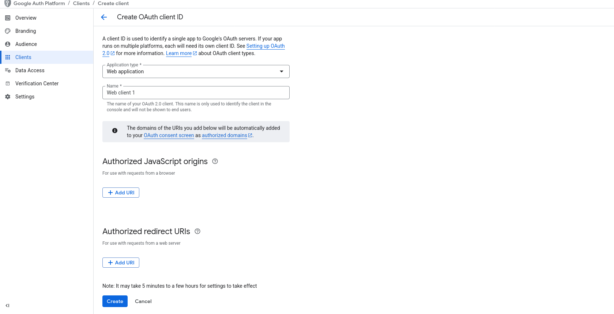 

- The newly created client also requires authorised origins and redirect URIs. Remember to hit "Save" when you change these values.

### Origins

If your app is hosted locally, enter the following URLs:

1. http://localhost
1. https://localhost
1. http://localhost:3000
1. https://localhost:3000

Change the port number to whatever port MMDL is using.

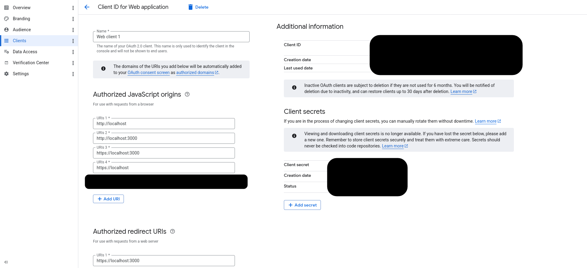 


If you're using a custom domain, you can enter its TLD like so:

1. https://example.com

### Redirect URIs

If your app is hosted locally, enter the following URLs:

1. https://localhost
1. https://localhost:3000
1. https://localhost/accounts/caldav/oauth/register
1. https://localhost:3000/accounts/caldav/oauth/register

Change the port number to whatever port MMDL is using.

If you're using a custom domain, you can enter it like so:

1. https://example.com/accounts/caldav/oauth/register

## Creating an Audience

Our newly created app will be assigned a "Testing" status, and therefore, it will only be available to limited users, who will have to be manually added. You can only give access to a 100 users while your app has a "Testing" status.

To do so, click on "Audience" on the left panel. Click "Add users" in the "Test users" section and enter the gmail addresses of those you want to give an access to.

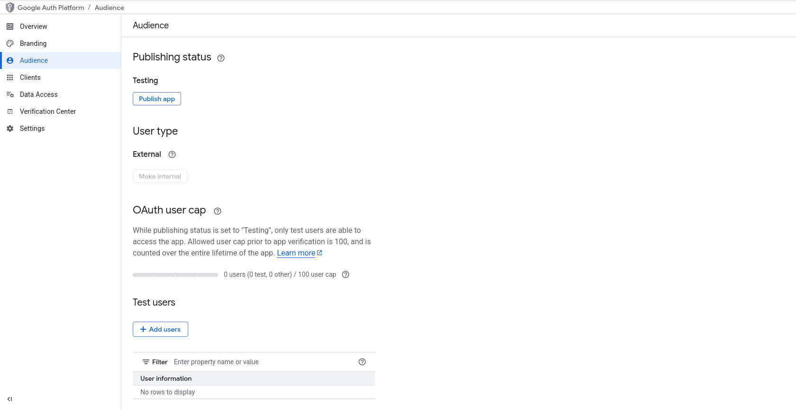 


## Adding the Account to MMDL

Now that we have enabled app in Google's Developer Console, we will need to add it to MMDL.

 - Visit ```accounts/caldav``` page in MMDL. Click on "Add".
 - Select "Authentication Type" as "OAuth". You will not need to add a server url for OAuth account.
 - Select "Google" as the "Authentication Provider".
 - Enter your gmail address as the CalDAV username.
 - Enter the client id you obtained from Google.
 - On clicking add, you will be taken to Google authentication page. Login to your Google account.
 - After you login, you will be shown a warning that you're logging into a "unverified" app. Click on "Continue".

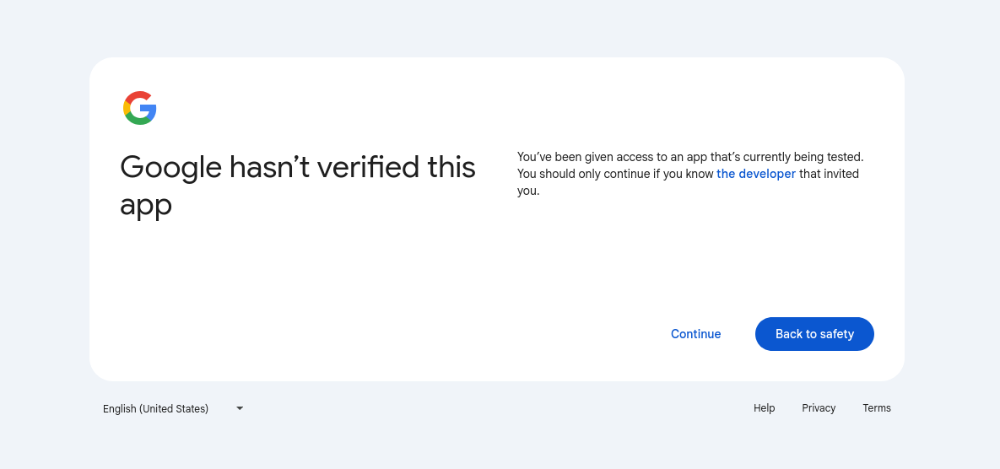 

- You will then be shown the permissions that the new app is requesting. Select **all three** to make sure MMDL has permissions to read/edit/delete items from your Google Calendar account. 

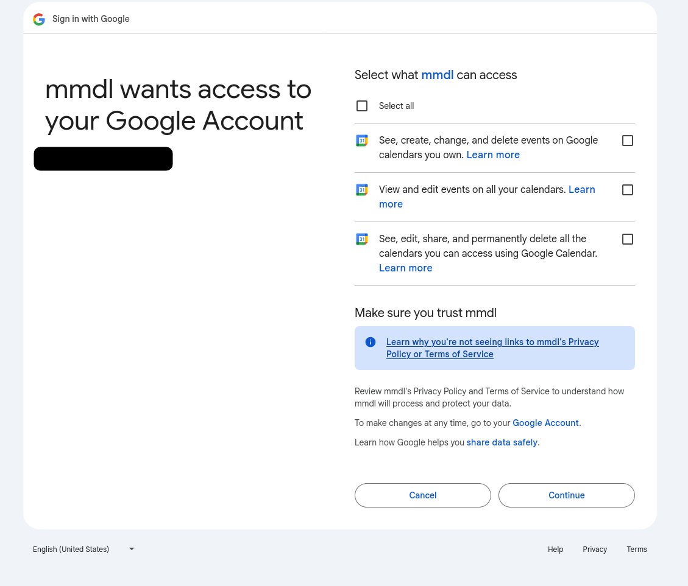 

- You will be redirected back to MMDL. Enter your Client Id and Client Secret to finally add your Google Calendars to MMDL.
- Wait for sync to complete and voila!
 
